# CaviNet user manual

This manual is for the **doctors** who use CaviNet and the **administrators** who manage its
accounts. It needs no technical knowledge. (Installing CaviNet is in
[DEPLOYMENT.md](DEPLOYMENT.md).)

The pictures were taken from CaviNet itself with made-up data: no real patient appears in this
manual.

## Contents

- [What CaviNet is, and what it is not](#what-cavinet-is-and-what-it-is-not)
- [Opening CaviNet](#opening-cavinet)
- **For doctors**
  1. [Signing in](#1-signing-in)
  2. [The dashboard](#2-the-dashboard)
  3. [Patients](#3-patients)
  4. [Uploading a CT scan](#4-uploading-a-ct-scan)
  5. [Following the analysis](#5-following-the-analysis)
  6. [Reading the result](#6-reading-the-result)
  7. [The PDF report](#7-the-pdf-report)
  8. [Notifications](#8-notifications)
  9. [Your password and signing out](#9-your-password-and-signing-out)
- **For administrators**
  10. [Users](#10-users)
  11. [The audit log](#11-the-audit-log)
  12. [The AI model page](#12-the-ai-model-page)
- [When something goes wrong](#when-something-goes-wrong)
- [Words used in CaviNet](#words-used-in-cavinet)

## What CaviNet is, and what it is not

CaviNet looks at a patient's **chest CT scan** and estimates whether the pattern looks more like
**pulmonary tuberculosis (TB)** or **non-tuberculous mycobacterial (NTM) lung disease**. It gives
a probability, says how confident it is, and explains the result in plain words.

- It is **decision support only. Not a diagnosis. Confirm with laboratory tests.** This
  sentence appears on every result and every report.
- It is meant for patients **already suspected of mycobacterial lung disease**. It cannot say
  whether someone is healthy, and it does not know other lung diseases.
- It does **not** find or mark cavities or other lesions.
- It is a **research prototype**, not a medical device.

> **The red "DEMO MODEL: NOT FOR CLINICAL USE" banner.** Until the real model has been trained
> on the hospital dataset, CaviNet uses a demo model trained on computer-made (synthetic) scans.
> Its results say **nothing** about a real patient. While the banner is shown, use CaviNet only
> to practise and to demonstrate it.

## Opening CaviNet

- Open the address you were given, usually **http://localhost:8080** on the team laptop.
- Use a recent **Chrome, Edge or Firefox**, in a window at least 1280 pixels wide (a normal
  laptop screen).
- You need an account. There is no "sign up": an administrator creates accounts.

---

# For doctors

## 1. Signing in

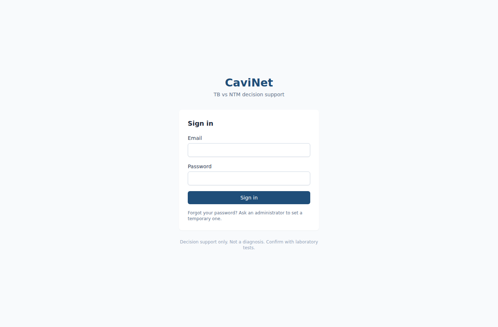

1. Type your **email** and **password**, then click **Sign in**.
2. **The first time** (and after an administrator resets your password) you must choose your
   own password before anything else:

   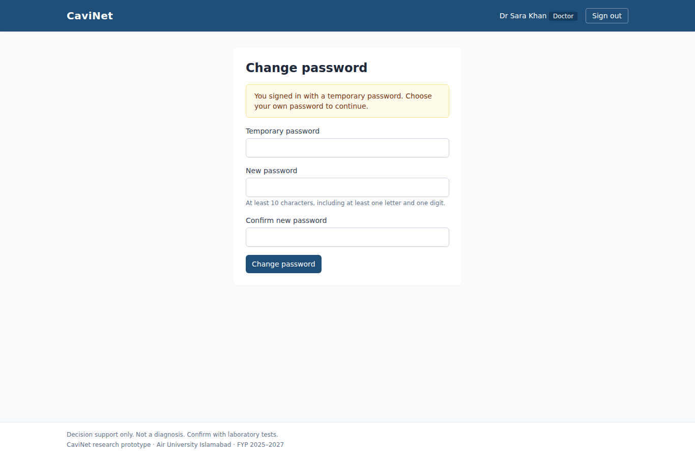

   Type the temporary password you were given, then your new password twice, and click
   **Change password**.

   A password needs **at least 10 characters, with at least one letter and one digit**.

Good to know:

- After **5 wrong passwords** in a row, the account is locked for **15 minutes**.
- CaviNet **signs you out after 30 minutes without activity**, and every session ends after
  8 hours. Sign in again to continue; nothing you saved is lost.
- Forgot your password? Ask an administrator to set a temporary one (CaviNet sends no emails).

## 2. The dashboard

After signing in you see the **Dashboard**.

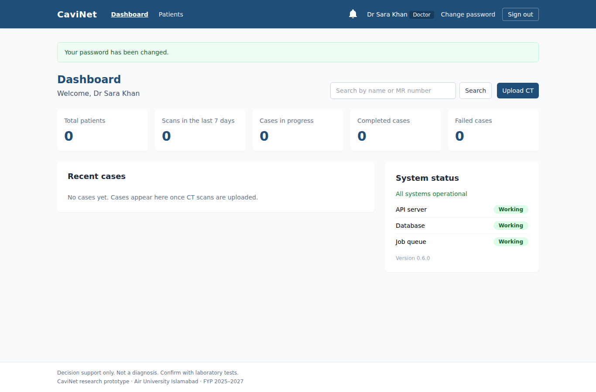

- **The counts**: total patients, scans uploaded in the last 7 days, cases in progress,
  completed cases and failed cases.
- **Recent cases**: the 10 newest scans, with their status and result. Click **Open case** to
  see one.
- **Search** finds a patient by name or MR number.
- **Upload CT** starts an upload (you then choose the patient).
- **System status** shows whether CaviNet's parts are working.

The dashboard updates by itself.

## 3. Patients

Click **Patients** at the top to see the list (20 per page). Search by name or MR number, sort
by clicking a column title, and use **Next** and **Previous** to move between pages.

### Adding a patient

Click **Add patient**, fill in the form and click **Add patient**.

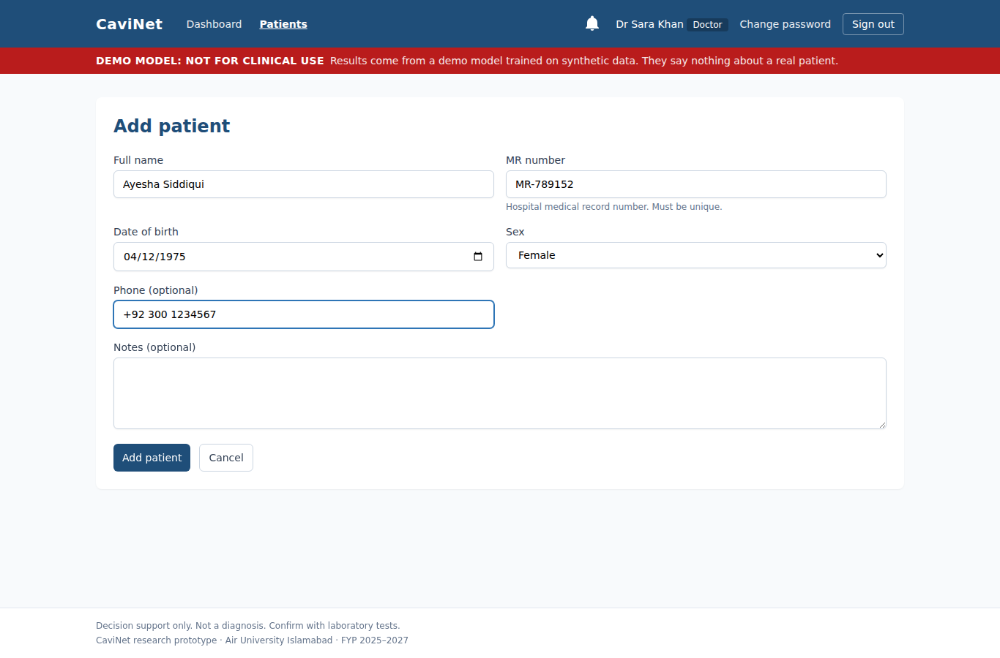

| Field | Notes |
|---|---|
| Full name | Required. |
| MR number | Required. The hospital's medical record number; each patient has a different one. |
| Date of birth | Required. Used for the patient's age on the report. |
| Sex | Required: male or female. |
| Phone, Notes | Optional. |

If something is missing or wrong, the message under the field says what to fix.

### The patient's page

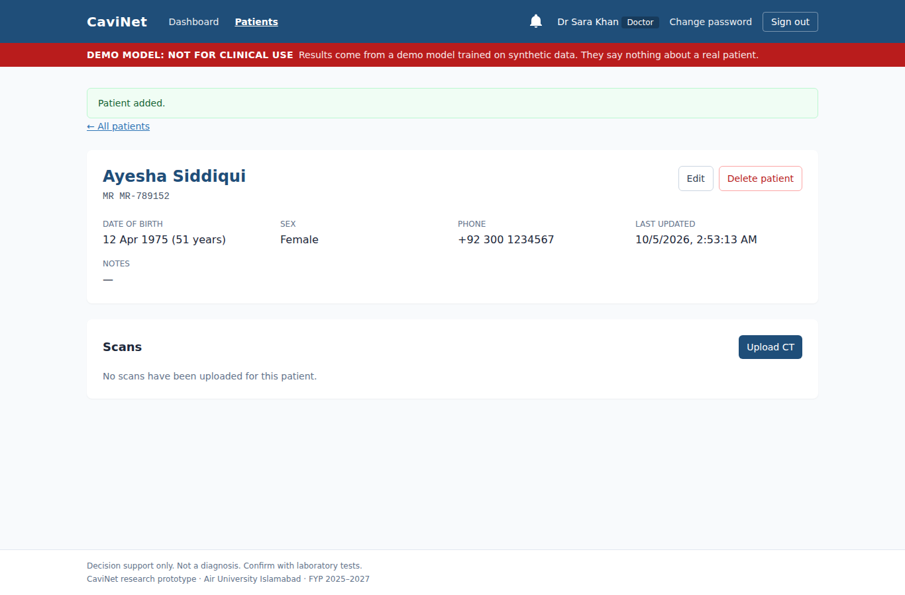

It shows the patient's details and the list of **scans** with their date, status and result.
From here you can **Upload CT**, **Edit** the details, or **Delete** the patient.

> **Deleting is permanent.** It removes the patient and all their scans, results, images and
> reports. CaviNet asks you to type the MR number to confirm. There is no undo (only an
> administrator's backup can bring data back).

## 4. Uploading a CT scan

Click **Upload CT** on the patient's page (or on the dashboard, then choose the patient).

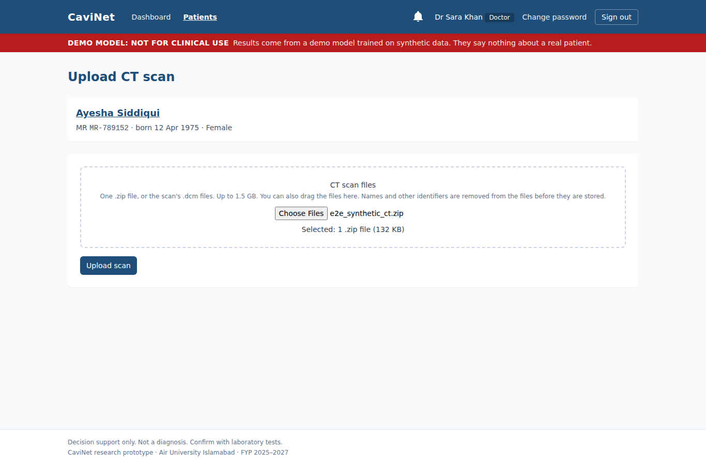

1. Click **Choose files** (or drag the files onto the page) and select **either**:
   - **one .zip file** containing the scan (any folders inside are fine), **or**
   - **the scan's .dcm files** (select them all).
2. Click **Upload scan**. A progress bar shows the upload; **Cancel upload** stops it.

What CaviNet accepts:

- DICOM files of a **CT** scan, **axial** slices (cross-sections of the chest);
- **at least 50 slices**, all the same size, **at most 5 mm apart**;
- **up to 1.5 GB** in total.

If the files contain several image series, CaviNet uses the one with the most slices and says
so on the case page.

> **Names are removed.** Before a scan is stored, CaviNet removes names, IDs, birth dates,
> addresses, the hospital name and doctors' names from the files. Only these cleaned files are
> kept. The patient's identity stays in the patient record only.

If the scan is refused, a red box explains why. The common reasons:

| Message (shortened) | What to do |
|---|---|
| "The scan has 30 slices; at least 50 are needed." | Upload the full chest series, not a few selected images. |
| "The slices are 7.5 mm apart; the maximum is 5 mm." | Export a thinner-slice reconstruction from the scanner or PACS. |
| "The slices are not axial" | Upload the axial series, not a coronal or sagittal one. |
| "… is MR, not a CT scan" | CaviNet analyses chest CT only. |
| "… of the uploaded files are not DICOM" | Upload only the .dcm files, or a .zip containing them (no PDFs, JPGs or reports). |
| "The .zip file is damaged" / "password-protected" | Create the .zip again, without a password. |
| "The upload is larger than the 1.5 GB limit." | Upload only the chest CT series, or compress it as a .zip. |

## 5. Following the analysis

After the upload, CaviNet opens the **case page**. The analysis runs by itself; you can wait,
or leave the page and come back later. A notification tells you when it has finished.

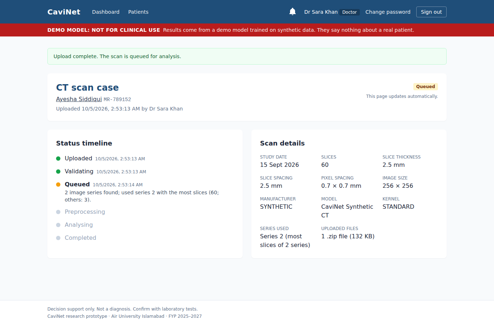

The **status timeline** shows each step with its time:

| Status | Meaning |
|---|---|
| Uploaded | The files arrived. |
| Validating | CaviNet checks the files are a usable chest CT. |
| Queued | Waiting for the analysis to start. |
| Preprocessing | Finding the lungs and preparing the images for the model. |
| Analysing | The AI model is working. |
| **Completed** | The result is ready. |
| **Failed** | The scan could not be analysed; the reason is shown. Upload it again or a different series. |

The analysis takes about **1 to 3 minutes** on the team laptop.

## 6. Reading the result

When the case is completed, the **AI result** appears on the case page.

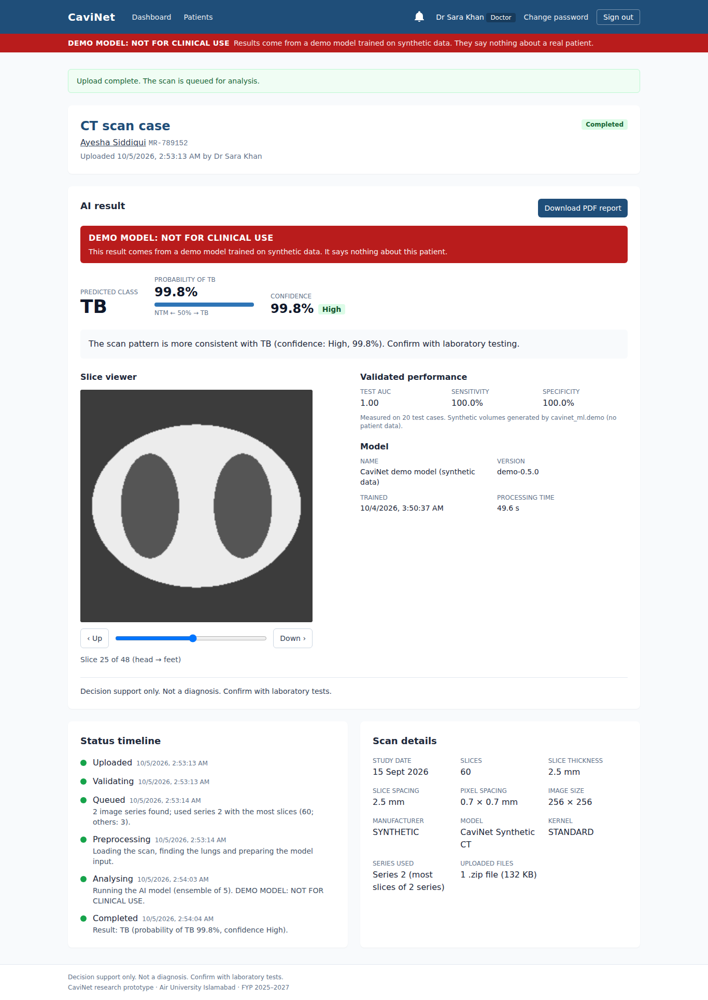

| Part | What it means |
|---|---|
| **Predicted class** | **TB** or **NTM**: what the scan pattern looks more like. |
| **Probability of TB** | From 0% to 100%. Above 50% means TB is predicted; below 50%, NTM. The bar shows where it lies between NTM and TB. |
| **Confidence** | The probability of the class it predicts: the probability of TB for a TB result, or 100% minus it for an NTM result (always 50% to 100%). |
| **Confidence band** | **High**: 80% or more. **Moderate**: 65% to 79.9%. **Low**: below 65%, shown as **"Inconclusive: the model is not confident"**. |
| **Explanation** | The result in one sentence, e.g. "The scan pattern is more consistent with TB (confidence: High, 86.0%). Confirm with laboratory testing." |
| **Warnings** | Anything unusual in the analysis, e.g. that the lungs could not be outlined and the whole body outline was used. Treat such a result with extra care. |
| **Slice viewer** | 48 slices through the lungs, from head to feet. Drag the slider or use **Up** and **Down**. |
| **Validated performance** | How well this model did on test patients it had never seen: AUC (how well it separates TB from NTM; 0.5 is guessing, 1.0 is perfect), sensitivity (TB cases it called TB) and specificity (NTM cases it called NTM). |
| **Model** | The model's name, version and training date, and how long the analysis took. |

**How to use the result:** as one piece of information next to the clinical picture and the
laboratory tests, never on its own. An "Inconclusive" result means the scan does not lean
clearly either way. TB and NTM can look very alike on CT.

## 7. The PDF report

Click **Download PDF report** at the top of the AI result. The report downloads at once
(one click), named after the patient's MR number and the date.

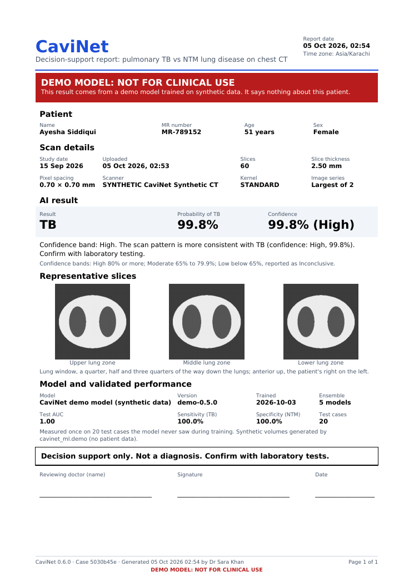

The one-page report contains:

- the CaviNet header and the **report date**;
- the patient's **name, MR number, age** (at the scan) and **sex**;
- the **scan details** (study date, slices, slice thickness, pixel spacing, scanner, kernel);
- the **result, probability of TB, confidence and band**, with the explanation;
- **three representative slices** (upper, middle and lower lungs);
- the **model version** and its **validated performance**;
- the **disclaimer**, and a **signature line** for the reviewing doctor.

Print it, review it, and sign it like any other report. A demo-model report carries the red
DEMO banner and must not be used for a patient.

> The report contains the patient's name. Store and share it as you would any medical record.
> CaviNet does not keep a copy: it creates the report each time you download it. Every
> download is recorded in the audit log (who and when, not the content).

## 8. Notifications

The **bell** at the top right shows how many notifications you have not read yet. CaviNet
checks for new ones every 10 seconds.

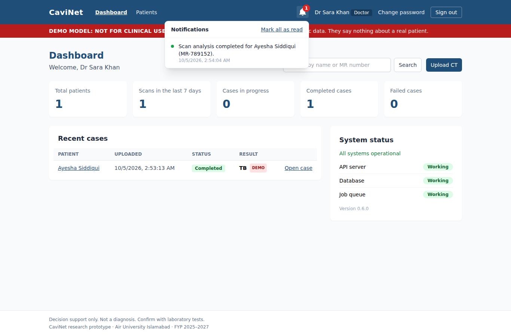

- You get a notification when a scan **you uploaded** has finished analysing, or has failed.
- Click a notification to open the case; it is then marked as read.
- **Mark all as read** clears the count.

## 9. Your password and signing out

- **Change password** (top right): type your current password and the new one twice.
- **Sign out** (top right) ends your session. Sign out when you leave a shared computer.

---

# For administrators

Administrators manage accounts and look after the system. **They cannot see patients, scans or
results**: patient data is only for doctors.

The first administrator account is created when CaviNet is installed. Its email and temporary
password are in the installer's `.env` file (see [DEPLOYMENT.md](DEPLOYMENT.md)); you must
choose your own password at first sign-in.

## 10. Users

Click **Users** at the top.

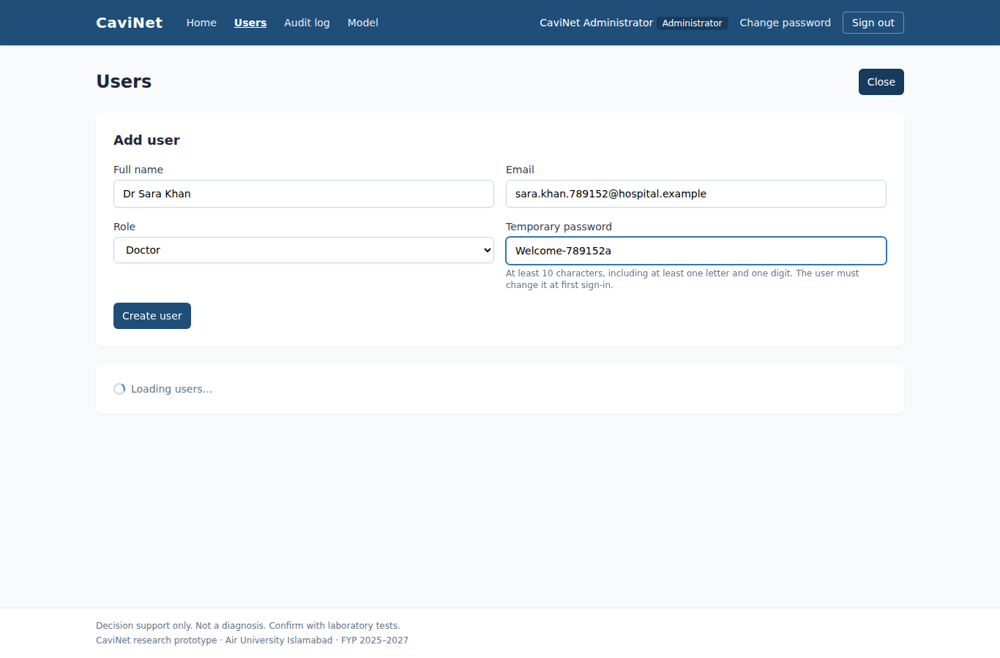

- **Add user**: type the person's full name and email, choose the role (**Doctor** or
  **Administrator**) and a **temporary password**, then click **Create user**. Give the
  person the temporary password in person or by phone; they must change it at first sign-in.
- **Role**: change it with the list in the user's row.
- **Reset password**: when someone forgets theirs, set a new temporary password. They must
  change it at their next sign-in.
- **Deactivate**: the person can no longer sign in (for example when they leave). Their name
  stays in the audit log. **Reactivate** lets them sign in again.
- A **locked** account (5 wrong passwords) unlocks by itself after 15 minutes, or at once when
  you reset its password.

You cannot deactivate yourself or change your own role, so there is always an administrator.

## 11. The audit log

Click **Audit log** to see who did what, and when.

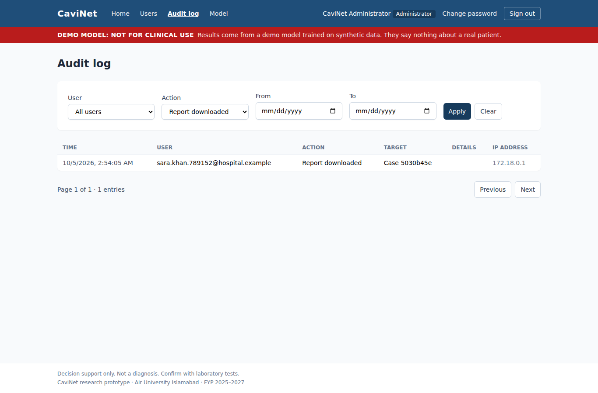

It records sign-ins (successful and failed), sign-outs, locked accounts, password changes,
user management, patients added, edited and deleted, scans uploaded, results viewed and
**reports downloaded**.

- Filter by **user**, **action** and **date range**, then click **Apply**; **Clear** removes
  the filters.
- The log never contains medical content: patients and cases appear only as record numbers,
  and passwords are never recorded.

## 12. The AI model page

Click **Model** to see the installed AI model: its name, version, training date, whether it
is the **demo** model or a trained one, and its measured results on test patients.

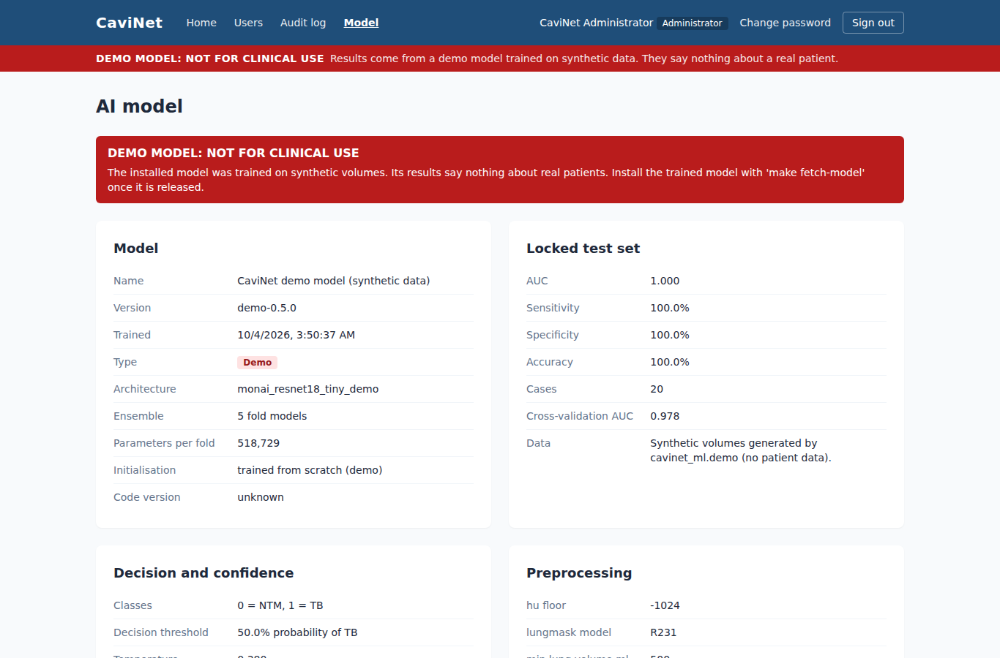

When the trained model is installed, the red DEMO banner disappears everywhere.

---

## When something goes wrong

| What you see | What to do |
|---|---|
| "Incorrect email or password." | Check the email and password (passwords are case-sensitive). After 5 attempts the account locks for 15 minutes. |
| "Too many failed sign-in attempts. Try again in N minute(s)." | Wait, or ask an administrator to reset your password. |
| "You were signed out after 30 minutes of inactivity." | Sign in again; nothing you saved is lost. |
| "Your session has ended. Please sign in again." | Sessions last at most 8 hours (or an administrator reset your password). Sign in again. |
| "CaviNet cannot be reached…" | Check the network, and that CaviNet is running on the team laptop (`make up`). |
| "CaviNet's server is not responding right now…" | It is starting or restarting. Wait a minute and try again. |
| "Something went wrong" page | Click **Reload the page**. If it keeps happening, tell an administrator what you were doing. |
| The scan was refused | Read the reason in the red box; see the table in [Uploading a CT scan](#4-uploading-a-ct-scan). |
| The case **Failed** | The reason is on the case page. Upload the scan again; if it fails again, try another series or tell an administrator. |
| The analysis stays on one step for more than 10 minutes | Tell an administrator (the analysis service may need restarting). |
| "The report could not be downloaded" | Try again; check the case is **Completed**. |
| "No access" | That page is for the other role (doctors and administrators see different pages). |

## Words used in CaviNet

| Word | Meaning |
|---|---|
| TB | Tuberculosis. |
| NTM | Non-tuberculous mycobacteria: related bacteria causing a TB-like lung disease that needs different treatment. |
| CT scan, slice | A 3D X-ray scan of the chest made of many thin cross-sectional images (slices). |
| DICOM | The standard file format of scanners. |
| Case | One uploaded scan of a patient and its analysis. |
| Confidence band | High, Moderate or Low (Inconclusive): how sure the model is. |
| AUC | A score from 0.5 (guessing) to 1.0 (perfect) of how well the model separates TB from NTM. |
| Demo model | A practice model trained on synthetic scans; its results mean nothing for real patients. |
